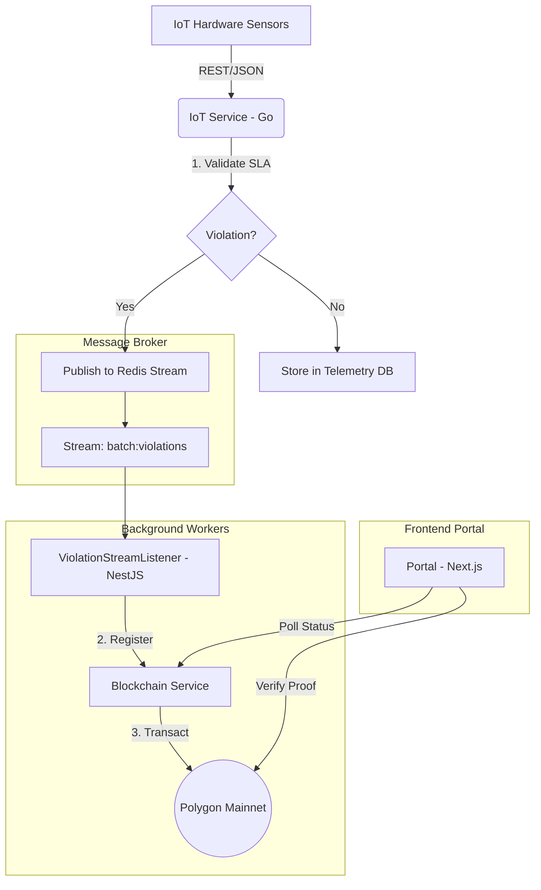

# Architecture V2: Event-Driven Infrastructure

This document details the high-performance architecture implemented in **Global FoodTech Bridge v3.0**. The platform has transitioned from a synchronous request-response model to a resilient, asynchronous event-driven system.

## 🌉 Logic Flow Overview

## 🛠 Component Roles

### 1. Ingestion Layer (Go)
The **[IoT Service](../../apps/backend/iot-service)** acts as the fast-path gateway. Its objective is to provide sub-second response times to thousands of IoT sensors. It offloads heavy tasks (blockchain transactions) to the background queue.

### 2. Messaging Layer (Redis 7)
We use a managed **Redis** instance in Railway as our central message broker. 
- **Redis Streams** provide persistent, ordered, and scalable event storage.
- **Consumer Groups** ensure that violation events are processed reliably even if a worker crashes.

### 3. Notarization Layer (NestJS)
The **[Blockchain Service](../../apps/backend/blockchain-service)** runs a dedicated `ViolationStreamListener`. 
- **Decoupling**: It isolates the blockchain's latency and gas market fluctuations from the IoT ingestion path.
- **Retry Logic**: Failed transactions can be retried without losing sensor data.

### 4. Verification Layer (Next.js)
The **[Portal](../../apps/frontend/portal)** directly interacts with both the Blockchain Service (for real-time status) and the Polygon network.
- **Admin Superuser**: For testing and audit purposes, users with the `ADMIN` role can bypass stage-specific restrictions (e.g., performing notarization or sensor pairing regardless of the current batch status).

## 🚀 Benefits of V2 Architecture
- **Zero-Data-Loss**: Events stay in Redis until acknowledged (`XACK`).
- **Resilience**: The system continues accepting sensor data even if the blockchain network is congested.
- **Scalability**: We can horizontally scale the background workers (Consumer Groups) to handle peaks in transaction volume.

---
© 2026 Global FoodTech Bridge | Infrastructure V3.0
